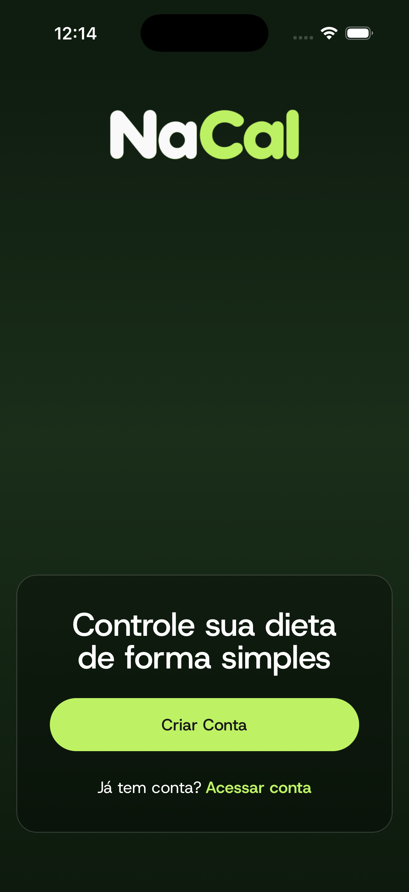
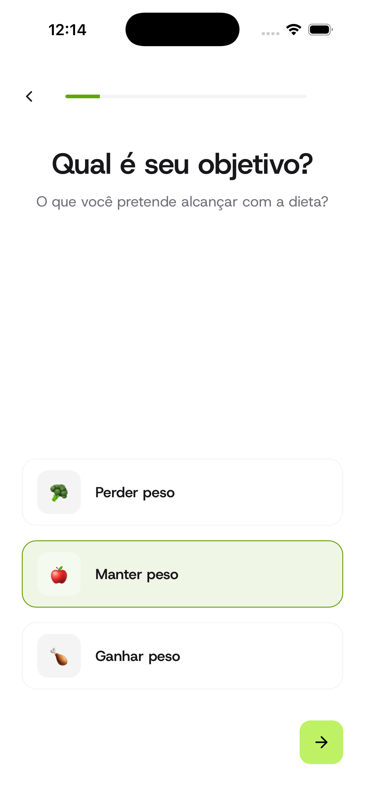
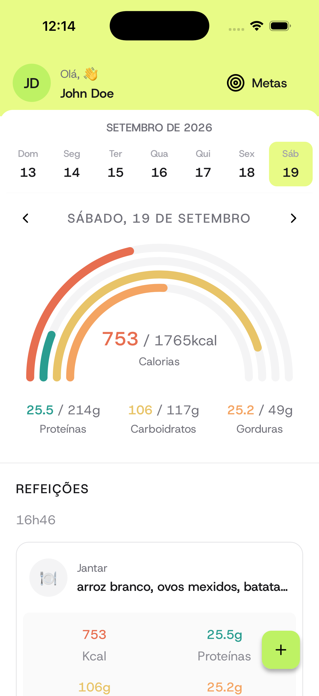
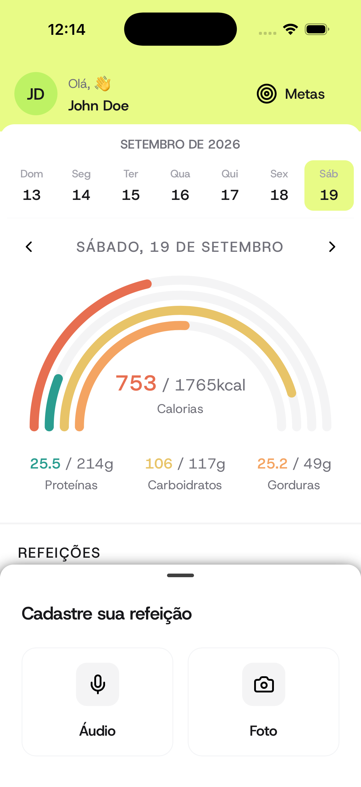
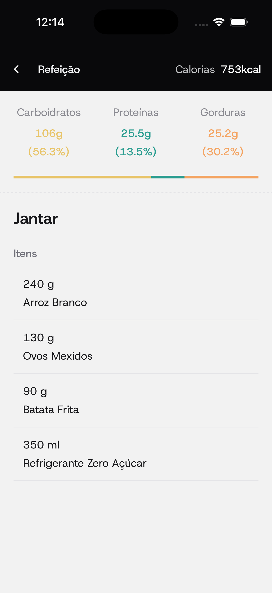
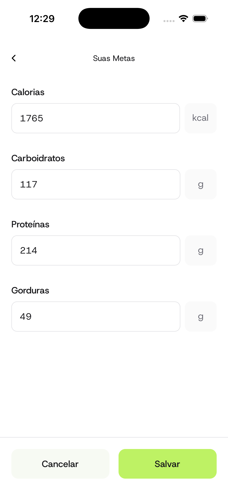

# NaCal

**NaCal** é um aplicativo de controle de dieta simples e amigável: "Controle sua dieta de forma simples." O usuário registra suas refeições em segundos através de uma **foto do prato** ou uma **nota de voz de até 30 segundos**, que são analisadas automaticamente por IA para identificar os alimentos, quantidades e macronutrientes (proteínas, carboidratos e gorduras). A partir de um onboarding curto, o backend calcula um plano diário personalizado de calorias e macros, e a home mostra em um único olhar o progresso do dia contra esse plano.

Diferente de contadores de calorias tradicionais, não há busca manual de alimentos, leitura de código de barras ou digitação de dados. A interface é toda em **português brasileiro**, com voz acolhedora e sem julgamentos.

Este repositório contém o **app frontend** (web + iOS + Android). O backend é uma API serverless separada; ver [Documentação relacionada](#documentação-relacionada).

## Demonstração

<!-- Preencha a URL quando houver deploy publicado. -->

**Web (PWA):** _em breve_

|                                                                                                       |                                                                                               |                                                                                            |
| ----------------------------------------------------------------------------------------------------- | --------------------------------------------------------------------------------------------- | ------------------------------------------------------------------------------------------ |
| <sub>**Boas-vindas**</sub>                                                                            | <sub>**Onboarding**</sub>                                                                     | <sub>**Home**</sub>                                                                        |
|                         |  |  |
| <sub>**Criar refeição**</sub>                                                                         | <sub>**Detalhes da refeição**</sub>                                                           | <sub>**Suas Metas**</sub>                                                                  |
|  |           |           |

## Funcionalidades

- **Autenticação completa**: Cadastro e login com e-mail/senha, recuperação de senha por código e login com **Google (OAuth 2.0 + PKCE)**;
- **Sessão silenciosa**: Tokens persistem em AsyncStorage e o access token é renovado automaticamente em respostas `401` (interceptor de refresh no axios);
- **Onboarding em 7 etapas**: Objetivo, gênero, data de nascimento, altura, peso, nível de atividade e criação de conta: o backend deriva o plano diário de calorias e macros (TDEE/BMR);
- **Home com visão do dia**: Calendário semanal, progresso dos macros no **MacroRainbow**, lista das refeições do dia e pull-to-refresh;
- **Registro de refeição por foto ou áudio**: Captura de câmera (permissão usada somente no momento da foto) ou nota de voz com limite de **30 segundos** e playback para revisar antes de enviar;
- **Processamento assíncrono**: Upload da refeição e acompanhamento do status `UPLOADING → QUEUED → PROCESSING → SUCCESS/FAILED` (polling de 3s enquanto processa);
- **Detalhes da refeição**: Total de calorias e quebra de macros por alimento e da refeição;
- **Metas editáveis**: Override manual do plano derivado (calorias, proteínas, carboidratos e gorduras);
- **Perfil editável**: Nome, data de nascimento, altura, peso e gênero;
- **Planos e assinatura**: Free com **20 refeições AI/mês** e Pro (**R$ 9,99/mês** ou **R$ 99,90/ano**) ilimitado; **trial de 7 dias grátis** sem cartão (1 por conta), checkout via Asaas, cancelamento na tela de Planos e ativação via webhook refletida em `GET /me`;
- **Web + PWA**: Export estático instalável com ícones, manifest e splash, além dos builds nativos iOS e Android;
- **Paridade web/nativo**: branching por `Platform.OS` para date picker, vídeo, toasts, handling de arquivos e animações;
- **Toasts**: `sonner` na web e `sonner-native` no nativo, com import centralizado em `@/app/libs/sonner`.

## Telas

### AuthStack

| Tela              | Descrição                                                                                                                 |
| ----------------- | ------------------------------------------------------------------------------------------------------------------------- |
| `Welcome`         | Boas-vindas com login (e-mail/senha e Google) e links de cadastro/recuperação de senha                                    |
| `OnboardingIntro` | Introdução exibida antes do onboarding                                                                                    |
| `Onboarding`      | 7 etapas: `GoalStep`, `GenderStep`, `BirthDateStep`, `HeightStep`, `WeightStep`, `ActivityLevelStep`, `CreateAccountStep` |
| `ForgotPassword`  | Solicitação do código de recuperação de senha                                                                             |
| `ResetPassword`   | Redefinição da senha com o código recebido                                                                                |

### AppStack

| Tela          | Descrição                                                                               |
| ------------- | --------------------------------------------------------------------------------------- |
| `Home`        | Calendário semanal, MacroRainbow, refeições do dia, FAB de criação e pull-to-refresh    |
| `MealDetails` | Detalhes da refeição: status de processamento, calorias e macros (por alimento e total) |
| `EditGoals`   | Edição manual das metas diárias de calorias e macros                                    |
| `Profile`     | Edição do perfil e acesso às metas                                                      |
| `Plans`       | Planos Free vs Pro, trial, cota mensal, checkout (Asaas) e cancelamento                 |

A troca entre as stacks é dirigida pelo `AuthContext`: `RootStack` renderiza `Auth` enquanto `!isSignedIn || shouldShowOnboarding`, e `App` caso contrário.

## Arquitetura

O app é dividido em **duas camadas** com path aliases definidos no `tsconfig.json`, `@/app/*` (lógica) e `@/ui/*` (apresentação):

```text
┌──────────────────────────────────────────────────────────────────┐
│  src/ui  ·  apresentação  (alias @/ui/*)                         │
│                                                                  │
│  screens/     welcome · onboarding · forgotPassword              │
│               home · mealDetails · editGoals · profile           │
│               (convenção: index.tsx · styles.ts · use*.ts        │
│                · schema.ts)                                      │
│  components/  AppText · Button · Input · MacroRainbow ·          │
│               PhotoModal · AudioModal · DesktopGate · ...        │
└───────────────┬──────────────────────────────────────────────────┘
                │  tela → hook local (use*) → query/mutation
                ▼
┌──────────────────────────────────────────────────────────────────┐
│  src/app  ·  lógica  (alias @/app/*)                             │
│                                                                  │
│  hooks/queries/     useAccount · useListMealByDay ·              │
│                     useGetMealById · useGetPlans                 │
│  hooks/mutations/   useCreateMeal · useUpdateGoal ·              │
│                     useUpdateProfile · billing (trial/checkout/  │
│                     cancel)                                      │
│  services/          Service (axios + interceptor 401→refresh) ·  │
│                     AuthService · AccountsService ·              │
│                     MealsService · GoalService · BillingService  │
│  contexts/          AuthContext (isSignedIn · onboarding)        │
│  navigation/        RootStack → AuthStack | AppStack             │
│  libs/              AuthTokenManager · queryClient · sonner      │
│  config/env.ts      validação zod das EXPO_PUBLIC_*              │
└───────────────┬──────────────────────────────────────────────────┘
                │  axios (baseURL = EXPO_PUBLIC_API_URL)
                ▼
        NaCal API (serverless AWS)
```

### Fluxo de dados

```text
Tela (src/ui)
  → hook da tela (useHome, useOnboarding, useProfile, ...)
    → hook de query/mutation (TanStack Query)
      → Service (axios, interceptor 401 → refresh token)
        → API NaCal
          → retorno via react-query (cache, staleTime: Infinity)
```

### Fluxo de criação de refeição

1. Usuário toca no FAB da home e escolhe **foto** ou **áudio** (máx. 30s);
2. `PhotoModal` (câmera) ou `AudioModal` (gravação + playback) captura o arquivo;
3. `useCreateMeal` envia para `MealsService.create`, que chama `POST /create-meal` e faz o upload direto no S3 via **Presigned POST** (assinatura em base64);
4. O backend cria a refeição e dispara o processamento: o status avança por `UPLOADING → QUEUED → PROCESSING`;
5. Enquanto o status é de processamento, `useGetMealById` refaz a consulta a cada **3 segundos** até `SUCCESS` ou `FAILED`;
6. Em `SUCCESS`, a tela de detalhes mostra os alimentos, calorias e macros.

### Planos e pagamento (billing)

A tela `Plans` consome a API de billing (gateway Asaas). O webhook é exclusivo da API — o app nunca fala com o gateway:

| Endpoint             | Auth | Uso no app                                                                       |
| -------------------- | ---- | -------------------------------------------------------------------------------- |
| `GET /billing/plans` | JWT  | Catálogo (preço, ciclo, features) — `staleTime: Infinity`                        |
| `POST /billing/trial` | JWT | Trial de 7 dias (1 por conta) → `{ trialEndsAt }`                                |
| `POST /billing/checkout` | JWT | Cria o checkout Asaas → `{ checkoutUrl, expiresAt }`                          |
| `POST /billing/cancel` | JWT | Cancela trial (local) ou assinatura (gateway)                                   |
| `GET /me`            | JWT  | Reflete `subscription` (plan, status, trialEndsAt, paidUntil) + `mealQuota`       |

- **Web**: redirect na mesma aba — flag `nacal:checkout:pending` no `sessionStorage`, retorno em `/billing/return`, confirmação automática no `/me` (botão "Já paguei" como retry manual);
- **Native**: `WebBrowser.openAuthSessionAsync` + loop de confirmação no `/me`;
- **Cota FREE**: estourou a 21ª refeição do mês → `403 FREE_QUOTA_EXCEEDED` → toast + navegação para `Plans`;
- `POST /billing/webhooks/asaas` (público) roda só na API e é a fonte da verdade da ativação.

## Pré-requisitos

- [Node.js 20 ou superior](https://nodejs.org/en/)
- [Yarn](https://yarnpkg.com/) (o projeto usa `yarn.lock`, não npm/pnpm)
- **Web**: nenhum extra (roda pelo Metro);
- **iOS**: [Xcode](https://developer.apple.com/xcode/) + CocoaPods (para `expo run:ios`);
- **Android**: [Android Studio](https://developer.android.com/studio) com SDK + emulador ou dispositivo (para `expo run:android`);
- **Backend**: uma instância da [NaCal API](https://github.com/nivaldoandrade/nacal-api) deployada na AWS, com o Cognito User Pool e o Client ID; ver [Variáveis de ambiente](#variáveis-de-ambiente).

## Passo a passo

### 1. Clone o repositório

```bash
git clone https://github.com/nivaldoandrade/nacal-app.git

cd nacal-app
```

### 2. Instale as dependências

```bash
yarn
```

> **Atenção:** o script `postinstall` roda o **patch-package** e aplica os patches de `patches/` (hoje 1 patch em `expo-modules-jsi`, que corrige o build iOS no Xcode 26.3/Swift 6.2). Não remova o `postinstall` nem edite `node_modules` à mão.

### 3. Configure as variáveis de ambiente

```bash
# Copie o arquivo de exemplo
cp .env.example .env

# Edite o arquivo .env e preencha os valores
```

```env
EXPO_PUBLIC_API_URL=https://xxx.execute-api.sa-east-1.amazonaws.com
EXPO_PUBLIC_COGNITO_DOMAIN=https://xxxx.auth.sa-east-1.amazoncognito.com
EXPO_PUBLIC_COGNITO_CLIENT_ID=xxxxxxxxxxxxxxxxxxxxxxxxxx

# Opcional: returnUrl do checkout web (deve bater com o allowlist APP_WEB_URL da API)
# EXPO_PUBLIC_WEB_URL=https://192.168.100.21:8443
```

### 4. Inicie a aplicação

```bash
# Servidor de desenvolvimento (Metro)
yarn start

# Em outro terminal, escolha a plataforma:
yarn web      # navegador
yarn ios      # simulador/dispositivo iOS (expo run:ios)
yarn android  # emulador/dispositivo Android (expo run:android)
```

- **Web**: abre em `http://localhost:8081` (porta padrão do Metro);
- **iOS/Android**: a primeira execução gera as pastas `ios/` e `android/` via prebuild (essas pastas são gitignored).

## Variáveis de ambiente

| Variável                        | Descrição                                                                           | Obrigatório |
| ------------------------------- | ----------------------------------------------------------------------------------- | ----------- |
| `EXPO_PUBLIC_API_URL`           | URL base da NaCal API                                                               | Sim         |
| `EXPO_PUBLIC_COGNITO_DOMAIN`    | Domínio do Cognito User Pool (ex.: `https://xxxx.auth.sa-east-1.amazoncognito.com`) | Sim         |
| `EXPO_PUBLIC_COGNITO_CLIENT_ID` | Client ID do aplicativo no User Pool                                                | Sim         |
| `EXPO_PUBLIC_WEB_URL`           | URL pública do app web usada como `returnUrl` do checkout — deve passar pelo allowlist `APP_WEB_URL` da API (fallback web: `window.location.origin`; fallback native: `makeRedirectUri`) | Não         |

**Regras importantes:**

- As `EXPO_PUBLIC_*` só podem ser lidas através de **listas explícitas de propriedades**: `src/app/config/env.ts` (validado com zod) e `useSocialAuth.ts`. Não faça leitura genérica de `process.env`: o Metro precisa inlinear estaticamente cada variável para o export web de produção;
- O `.env` é gitignored. Consulte o `.env.example` para a lista completa;
- Após alterar env vars, reinicie o Metro (`yarn start -c` para limpar cache).

## Comandos

```bash
# Dependências
yarn                    # instalar (roda patch-package no postinstall)

# Desenvolvimento
yarn start              # inicia o Metro
yarn web                # app no navegador
yarn ios                # build + run no iOS (expo run:ios)
yarn android            # build + run no Android (expo run:android)

# Web (produção)
yarn export:web         # export estático para dist/
yarn serve:web          # serve o dist/ localmente

# Qualidade
yarn lint               # ESLint (expo lint): único check com script
npx tsc --noEmit        # typecheck (não há script dedicado)

# Nativo
npx expo prebuild --clean   # regenera pastas ios/ e android/

# Ícones e splash
python3 scripts/generate-icons.py   # ver scripts/README.md
```

Não há suíte de testes nem script de typecheck no projeto: `yarn lint` e `npx tsc --noEmit` são as verificações.

## Estrutura do código

```text
src/
├── app/                        # Lógica (alias @/app/*)
│   ├── config/
│   │   └── env.ts              # validação zod das EXPO_PUBLIC_*
│   ├── contexts/
│   │   └── AuthContext/        # isSignedIn, shouldShowOnboarding, refresh
│   ├── errors/
│   ├── hooks/
│   │   ├── queries/            # useAccount, useListMealByDay, useGetMealById,
│   │   │                       # useGetPlans
│   │   ├── mutations/          # useCreateMeal, useUpdateGoal, useUpdateProfile,
│   │   │                       # useStartTrial, useCreateCheckout, useCancelSubscription
│   │   └── useSocialAuth.ts    # Google OAuth 2.0 + PKCE
│   ├── libs/
│   │   ├── AuthTokenManager.ts # persistência de tokens (AsyncStorage)
│   │   ├── queryClient.ts      # retry: false
│   │   ├── sonner.ts           # platform-split de toast (web/native)
│   │   ├── getCheckoutReturnUrl.ts  # returnUrl do checkout Asaas
│   │   └── getFileInfo.ts
│   ├── navigation/             # RootStack, AuthStack, AppStack, OnboardingStack
│   ├── services/               # Service (axios + interceptor 401)
│   │                           # AuthService, AccountsService,
│   │                           # MealsService, GoalService, BillingService
│   ├── types/                  # Meal, Food, Subscription, ...
│   └── utils/
│
└── ui/                         # Apresentação (alias @/ui/*)
    ├── App.tsx
    ├── components/             # Button, Input, FormGroup, MacroRainbow,
    │                           # PhotoModal, AudioModal, DesktopGate, ...
    ├── screens/
    │   ├── welcome/            # index.tsx · styles.ts
    │   ├── onboarding/         # steps/ · context/ · schema.ts · use*.ts
    │   ├── forgotPassword/
    │   ├── home/               # components/ (WeekCalendar, CurrentGoal, Fab, ...)
    │   ├── mealDetails/
    │   ├── editGoals/
    │   ├── profile/
    │   └── plans/               # index.tsx · styles.ts · usePlansScreen.ts · components/
    ├── hooks/
    ├── styles/
    └── utils/
```

### Convenções por feature (pasta de tela/componente)

- `index.tsx`: componente da tela;
- `styles.ts`: estilos (StyleSheet);
- `use*.ts`: hook de dados/comportamento da tela;
- `schema.ts`: schemas zod pareados com react-hook-form (quando há formulário);
- `components/`: subcomponentes locais da tela.

### Regras de lint (`eslint.config.js`)

- Interfaces com prefixo **`I`** (`IFoo`), aspas simples, ponto e vírgula, trailing comma sempre em múltiplas linhas, `curly: all`, `eqeqeq` e `no-console: warn`.

### Convenções de dados

- Meal queries usam `staleTime: Infinity`; o refresh é manual (pull-to-refresh), exceto o polling de status em `useGetMealById`;
- `queryClient` roda com `retry: false`;
- Toasts sempre importados de `@/app/libs/sonner` (split de plataforma).

## Tecnologias

### App

- [Expo SDK 57](https://docs.expo.dev/) / [React Native 0.86](https://reactnative.dev/) / React 19;
- TypeScript (strict);
- [React Navigation 7](https://reactnavigation.org/) (native-stack);
- [TanStack Query 5](https://tanstack.com/query): cache e mutações;
- [react-hook-form](https://react-hook-form.com/) + [Zod](https://zod.dev/): formulários e validação;
- [Axios](https://axios-http.com/): client HTTP com interceptor de refresh;
- Expo modules: `camera`, `audio`, `video`, `auth-session`, `crypto`, `file-system`, `font`, `splash-screen`, `web-browser`, `linear-gradient`;
- `react-native-reanimated` 4 + `react-native-worklets`: animações;
- `react-native-gesture-handler`, `react-native-safe-area-context`, `react-native-screens`, `react-native-svg`, `react-native-keyboard-controller`;
- `@gorhom/bottom-sheet`;
- `@expo-google-fonts/host-grotesk`: tipografia;
- `lucide-react-native`: ícones;
- `sonner` / `sonner-native`: toasts;
- `patch-package`: patches sobre `node_modules`.

## Design

A identidade do NaCal é definida em [`DESIGN.md`](./DESIGN.md), fontes de verdade de tokens e componentes:

- **Marca**: wordmark **NaCal** com traço de destaque lime (`#D2F676`);
- **Tipografia**: Host Grotesk (300/400/500/600);
- **Paleta**: família lime como acento, cinzas neutros, preto/branco e cores reservadas para macros: tomate = calorias, teal = proteínas, amarelo = carboidratos, laranja = gorduras;
- **Componente assinatura**: **MacroRainbow**, progresso dos macros em uma única visão;
- **Estilo**: interface clara, voz amigável e acolhedora em pt-BR.

## Web e PWA

```bash
yarn export:web   # gera o build estático em dist/
yarn serve:web    # serve dist/ localmente (npx serve dist)
```

- O bundler é o **Metro** com `web.output: "single"` (aplicativo de página única);
- O `public/` traz manifest, ícones 192/512/maskable, apple-touch-icon e splash para o app ser **instalável como PWA**;
- `DesktopGate` bloqueia viewports com mais de **480px** no web (o produto é mobile-first); ao redimensionar para largura desktop, um aviso é exibido no lugar do app;
- Ícones e splash são regenerados por `python3 scripts/generate-icons.py`; ver [`scripts/README.md`](./scripts/README.md).

## Documentação relacionada

| Documento                                                | Conteúdo                                                                 |
| -------------------------------------------------------- | ------------------------------------------------------------------------ |
| [`PRODUCT.md`](./PRODUCT.md)                             | Plataforma, usuários, capacidades, restrições e princípios do produto    |
| [`DESIGN.md`](./DESIGN.md)                               | Design system: cores, tipografia, layout, componentes e regras nomeadas  |
| [`AGENTS.md`](./AGENTS.md)                               | Convenções do código, comandos e gotchas (o `CLAUDE.md` aponta para ele) |
| [`scripts/README.md`](./scripts/README.md)               | Geração de ícones e arte de splash                                       |
| [NaCal API](https://github.com/nivaldoandrade/nacal-api) | Backend serverless consumido pelo app (auth, perfil, metas, refeições e billing)     |

## Troubleshooting

### `yarn` falha ou o `postinstall` não roda
- Verifique se o script `postinstall` (`patch-package`) está intacto no `package.json`;
- Os patches em `patches/` são obrigatórias (hoje `expo-modules-jsi+57.0.7.patch`); nunca edite `node_modules` à mão;
- Rode `yarn` novamente na raiz do projeto.

### Build iOS falha no Xcode 26.3 / Swift 6.2
- É o bug upstream corrigido pelo patch (expo/expo#49214, `SWIFT_RETURNS_RETAINED` em `RuntimeScheduler.h`);
- Garanta que o patch foi aplicado (`yarn` + `patches/` presente) e **não** o remova;
- Depois, `npx expo prebuild --clean` e rode `yarn ios` de novo.

### Variáveis de ambiente não sobem no build web de produção
- `EXPO_PUBLIC_*` precisa estar numa **lista explícita de propriedades** (`src/app/config/env.ts` ou `useSocialAuth.ts`); leitura genérica de `process.env` não é inlineada pelo Metro;
- Confirme que o `.env` está preenchido e reinicie o Metro com cache limpo: `yarn start -c`;
- Veja a tabela em [Variáveis de ambiente](#variáveis-de-ambiente).

### Pastas `ios/` ou `android/` não existem ou estão desatualizadas
- Ambas são gitignored e regeneradas pelo prebuild;
- Rode `npx expo prebuild --clean` e depois `yarn ios` / `yarn android`.

### Login com Google não abre (ou não força o seletor de contas)
- Verifique `EXPO_PUBLIC_COGNITO_DOMAIN` e `EXPO_PUBLIC_COGNITO_CLIENT_ID` no `.env`;
- O scheme do app é `nacal` (definido no `app.json`); confirme o callback configurado no Cognito;
- O fluxo é Authorization Code + PKCE (`useSocialAuth.ts`); veja também o fluxo OAuth na documentação da API.

### Refeição fica em `PROCESSING` (ou nunca atualiza)
- O status só é consultado na tela de detalhes (`useGetMealById`, polling de 3s); abra a refeição para acompanhar;
- Na home, o refresh é manual: use o pull-to-refresh (`staleTime: Infinity`);
- Se ficar em `FAILED`, veja os logs da Lambda `processMeal` na API (Dead Letter Queue e alarme por email).

### Toasts não aparecem
- Importe sempre de `@/app/libs/sonner`: o módulo faz split de plataforma (`sonner` na web, `sonner-native` no nativo);
- Importar `sonner` diretamente no nativo (ou `sonner-native` na web) não renderiza.

### Tela branca/bloqueada no navegador em tela larga
- É o `DesktopGate` agindo por design: viewports acima de **480px** são bloqueados (produto mobile-first);
- Use as DevTools responsivas (largura ≤ 480px) para testar o web.

### Typecheck não roda com `yarn`
- Não há script de typecheck no `package.json`; rode manualmente: `npx tsc --noEmit`.

### `yarn lint` acusa erros
- Rode `yarn lint` e corrija; as regras mais comuns são aspas simples, ponto e vírgula, trailing comma em múltiplas linhas e interfaces com prefixo `I`.

## Licença

[MIT](./LICENSE)
